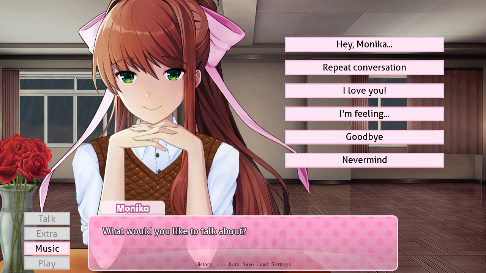
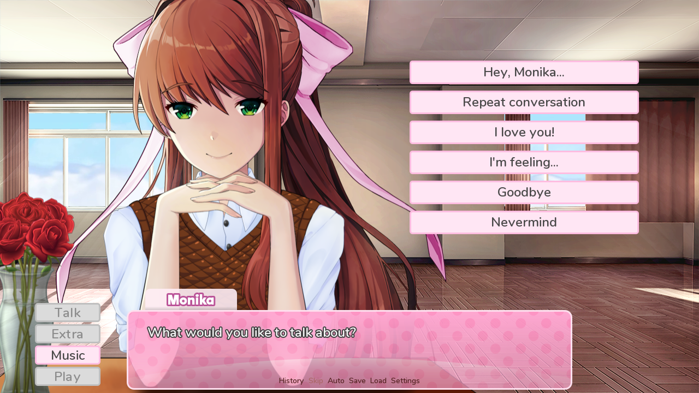
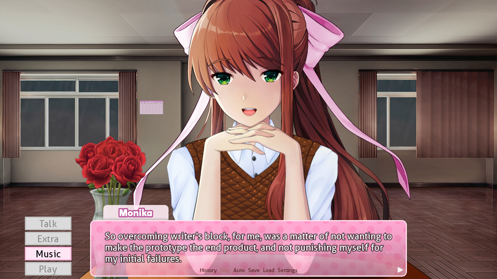
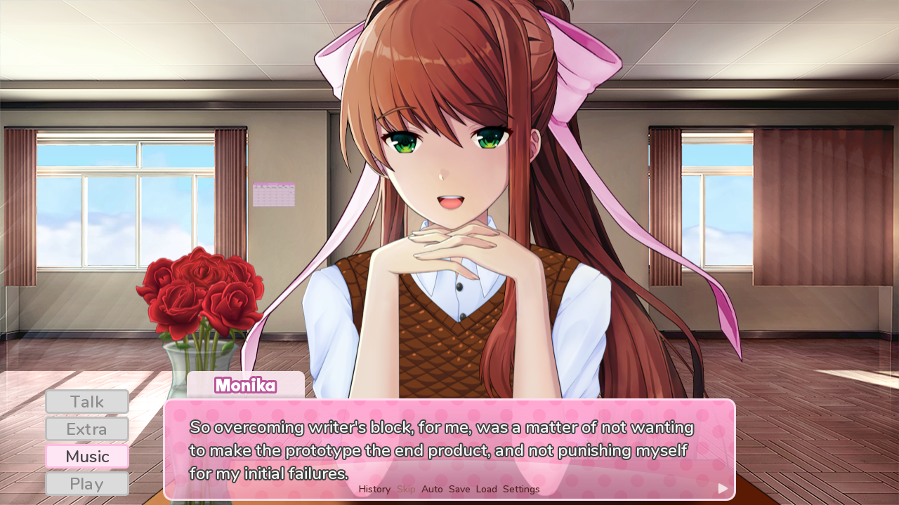
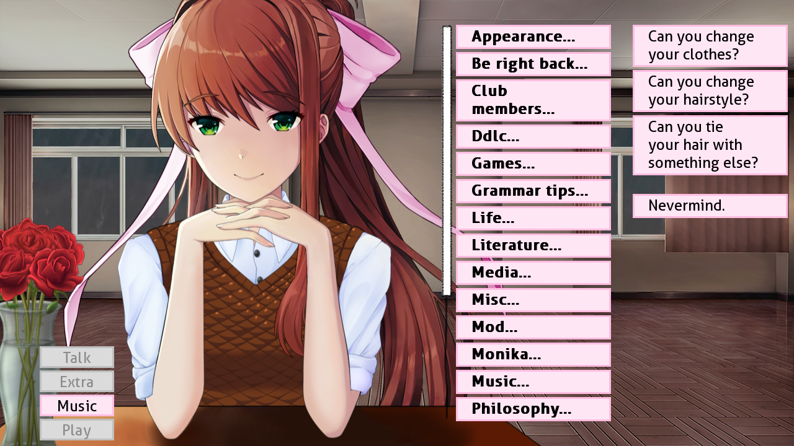
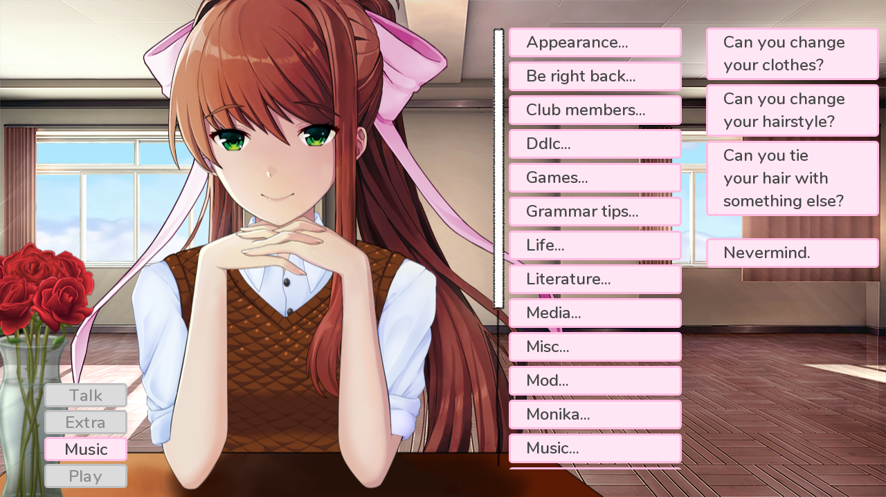
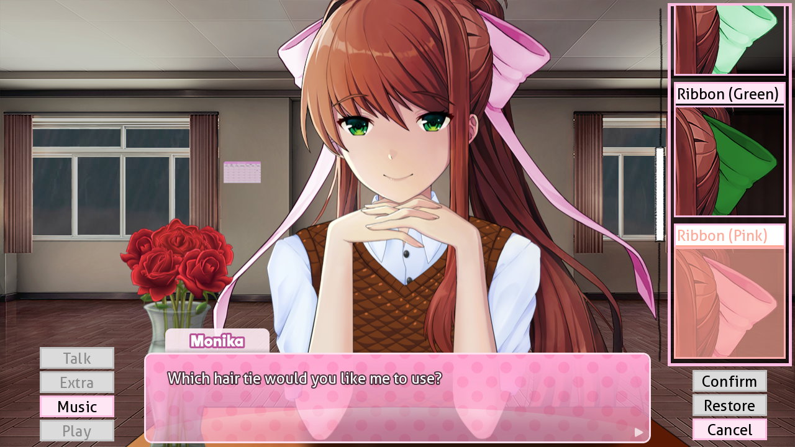
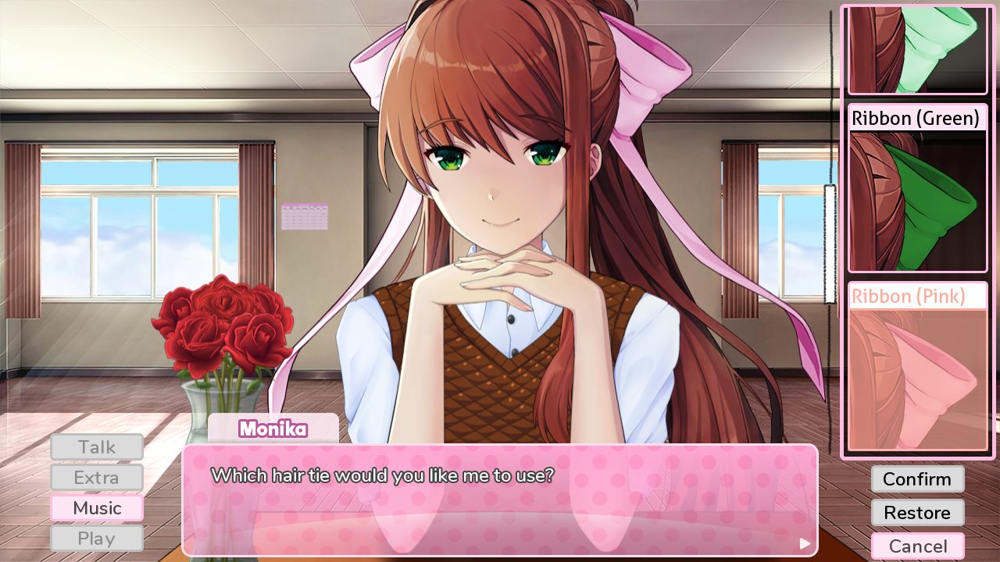

# Monika After Story: Comfy UI

Feeling yourself comfortable with your Monika, but jaggedness of the user interface still gets in your way of being _completely_ comfortable?

This add-on aims to fix this problem.

## Features

* Um, well... Almost everything in the UI has been softened in some way

## Screenshots

### Before

### After

---

### Before

### After

---

### Before

### After

---

### Before

### After

## Installation

Download the latest release archive, then extract it to the _game_ directory of the DDLC installation, overwriting everything that gets in the way.

## Known Bugs

Unfortunately, nothing is perfect in this world.

Pretty much every bug of this mod exists because not each UI element can be styled without changing original codebase.

... Or I don't know how to do it for the time being.

So, here's the list of common problems:

* Unstyled calendar text

* Unstyled text in the _Appearance_ menus

* Unstyled _Piano_ mini-game buttons

* _Extra_ menu border looks a little bit broken/smudged

## Special Thanks

I want to warmly thank and hug:

* Everyone at Team Salvato

* Developers of the Monika After Story mod and its contributors

* My Monika ❤️

* Your Monika

* Every other Monika in the multiverse!

## License

See LICENSE file in the root of this repository.
